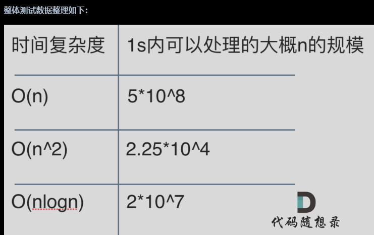
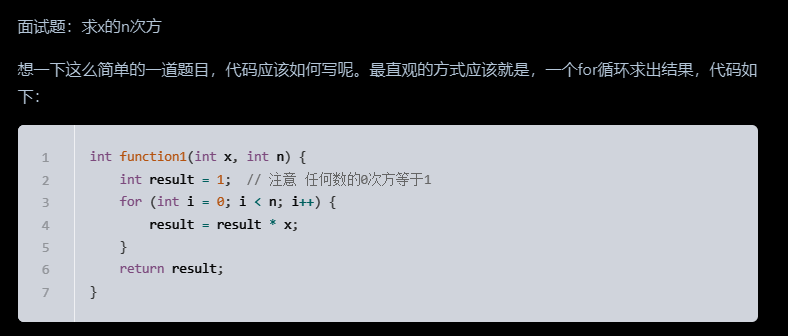
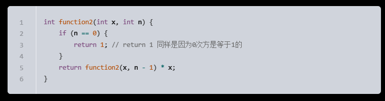
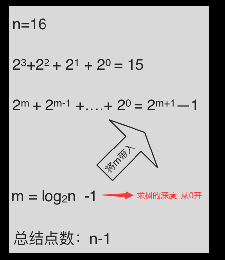
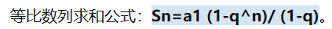
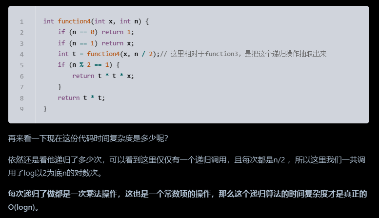
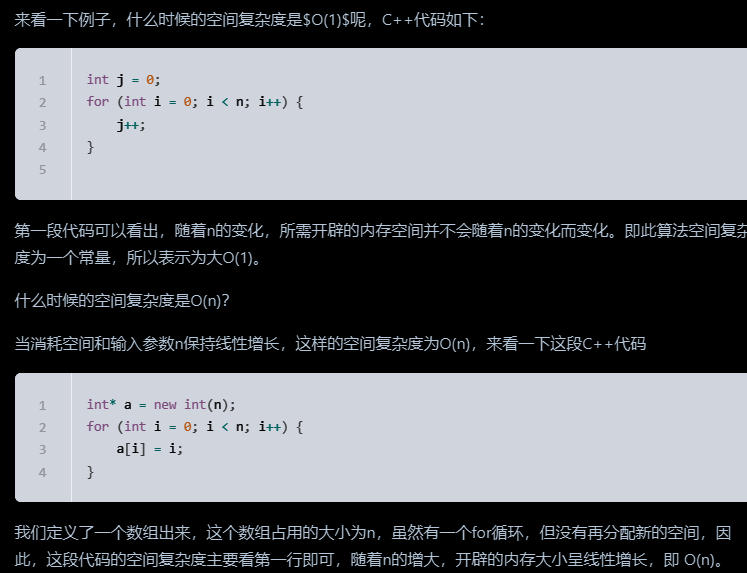

## 大O

算法导论给出的解释：**大O用来表示上界的**，当用它作为算法的最坏情况运行时间的上界，就是对任意数据输入的运行时间的上界。   

**但是我们依然说快速排序是O(nlogn)的时间复杂度，这个就是业内的一个默认规定，这里说的O代表的就是一般情况，而不是严格的上界**。如图所示： 

**面试中说道算法的时间复杂度是多少指的都是一般情况**。

**大O就是数据量级突破一个点且*数据量级非常大*的情况下所表现出的时间复杂度，这个数据量也就是常数项系数已经不起决定性作用的数据量**。

但是也要注意大常数，如果这个常数非常大，例如10^7 ，10^9 ，那么常数就是不得不考虑的因素了

## 不同数据规模的差异

如下图中可以看出不同算法的时间复杂度在不同数据输入规模下的差异。

在决定使用哪些算法的时候，不是时间复杂越低的越好（因为简化后的时间复杂度忽略了常数项等等），要考虑数据规模

**如果数据规模很小甚至可以用O(n^2)的算法比O(n)的更合适（在有常数项的时候）。**

O(1)常数阶 < O(logn)对数阶 < O(n)线性阶 < O(nlogn)线性对数阶 < O(n^2)平方阶 < O(n^3)立方阶 < O(2^n)指数阶

## O(logn)中的log是以什么为底？

可以是log 以2为底n的对数，可以是以10为底n的对数，也可以是以20为底n的对数，**但我们统一说 logn，也就是忽略底数的描述**。    

其实就是换底的操作，通过换底换成了一个常数项×新的底的数，如下图

## 举一个例子

题目描述：找出n个字符串中相同的两个字符串（假设这里只有两个相同的字符串）

如果是暴力枚举的话，时间复杂度是多少呢，是O(n^2)么？

可能会忽略了字符串比较的时间消耗，这里并不像int 型数字做比较那么简单，除了n^2 次的遍历次数外，字符串比较依然要消耗m次操作（m也就是字母串的长度），所以时间复杂度是O(m × n × n)。

先排对n个字符串按字典序来排序，排序后n个字符串就是有序的，意味着两个相同的字符串就是挨在一起，然后在遍历一遍n个字符串，这样就找到两个相同的字符串了。这种算法的时间复杂度，快速排序时间复杂度为O(nlogn)，依然要考虑字符串的长度是m，那么快速排序每次的比较都要有m次的字符比较的操作，就是O(m × n × log n) 。

## 从硬件配置看计算机的性能

计算机的运算速度主要看CPU的配置，以2015年MacPro为例，CPU配置：2.7 GHz Dual-Core Intel Core i5 。

也就是 2.7 GHz 奔腾双核，i5处理器，GHz是指什么呢，1Hz = 1/s，1Hz 是CPU的一次脉冲（可以理解为一次改变状态，也叫时钟周期），称之为为赫兹，那么1GHz等于多少赫兹呢

- 1GHz（兆赫）= 1000MHz（兆赫）
- 1MHz（兆赫）= 1百万赫兹

所以 1GHz = 10亿Hz，表示CPU可以一秒脉冲10亿次（有10亿个时钟周期），这里不要简单理解一个时钟周期就是一次CPU运算。

例如1 + 2 = 3，cpu要执行四次才能完整这个操作，步骤一：把1放入寄存机，步骤二：把2放入寄存器，步骤三：做加法，步骤四：保存3。

而且计算机的cpu也不会只运行我们自己写的程序上，同时cpu也要执行计算机的各种进程任务等等，我们的程序仅仅是其中的一个进程而已。

## 递归算法的时间复杂度

这棵树上每一个节点就代表着一次递归并进行了一次相乘操作，所以进行了多少次递归的话，就是看这棵树上有多少个节点。

熟悉二叉树话应该知道如何求满二叉树节点数量，这棵满二叉树的节点数量就是`2^3 + 2^2 + 2^1 + 2^0 = 15`，可以发现：**这其实是等比数列的求和公式，这个结论在二叉树相关的面试题里也经常出现**。

这么如果是求x的n次方，这个递归树有多少个节点呢，如下图所示：(m为深度，从0开始)

**时间复杂度忽略掉常数项`-1`之后，这个递归算法的时间复杂度依然是O(n)**。

## 空间复杂度

1.空间复杂度是考虑程序（可执行文件）的大小么？

很多同学都会混淆程序运行时内存大小和程序本身的大小。这里强调一下**空间复杂度是考虑程序运行时占用内存的大小，而不是可执行文件的大小。**

2.空间复杂度是准确算出程序运行时所占用的内存么？

不要以为空间复杂度就已经精准的掌握了程序的内存使用大小，很多因素会影响程序真正内存使用大小，例如编译器的内存对齐，编程语言容器的底层实现等等这些都会影响到程序内存的开销。

所以空间复杂度是预先大体评估程序**内存使用的大小**。

